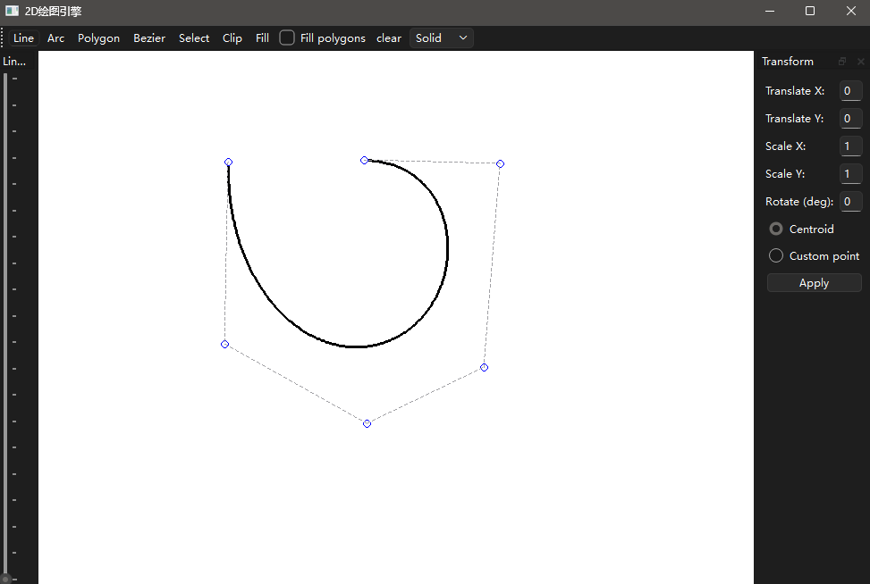

# GraphicEngine
## 此项目是基于 C++ (C++17) 和 Qt 框架开发的 2D 图形绘制引擎。该项目构建了一个自定义的绘图系统，实现了从基础图元绘制到复杂图形变换、裁剪和填充的一系列计算机图形学功能。


**📖 项目简介**

该项目采用 **MVC (Model-View-Controller)** 风格的架构设计：

- **View (CanvasWidget)**: 负责屏幕显示和捕获用户交互。
- **Controller (Tools)**: 不同的工具（如画线、选择）处理具体的鼠标逻辑。
- **Model/Engine (DrawEngine & Shapes)**: 负责核心的像素级渲染算法和图元数据管理。

主要用于演示或学习计算机图形学算法的实现（如光栅化、裁剪算法等）。

**✨ 功能特性**

**1\. 基础图元绘制**

支持多种基本几何图形的交互式绘制：

- **直线** (LineTool)：支持自定义线宽、线型和线帽。
- **圆弧** (ArcTool)：交互式绘制圆弧。
- **多边形** (PolygonTool)：支持多边形绘制。
- **贝塞尔曲线** (BezierTool)：绘制平滑曲线。

**2\. 图形操作与编辑**

- **选择模式** (SelectTool)：选中已有图元进行操作。
- **几何变换**：支持对图形进行平移、旋转和缩放。
    - 支持设置变换参考点（图形质心或自定义点）。
- **裁剪** (ClipTool)：实现图形裁剪功能。
- **填充** (FillTool)：支持区域填充算法（光栅化填充）。

**3\. 样式与属性**

在 UI 工具栏中支持实时调整：

- 线宽 (Pen Width)
- 线型 (Line Style)
- 线帽样式 (Line Cap)

**🛠️ 技术栈**

- **编程语言**: C++17
- **GUI 框架**: Qt 6 (兼容 Qt 5)
    - 组件: Widgets, LinguistTools
- **构建工具**: CMake (最低版本 3.16)

**📂 项目结构概览**


```text
GraphicEngine/
├── Core/                       # 核心架构模块
│   ├── basetool.h              # 工具基类：定义交互工具的通用接口
│   ├── canvaswidget.* # 画布组件：显示渲染结果、分发鼠标事件
│   ├── drawengine.* # 绘图引擎：执行具体的像素绘制算法
│   └── mainwindow.* # 主窗口：管理 UI、工具栏和工具切换
├── Shapes/                     # 图元数据模块 (Model)
│   ├── arcshape.* # 圆弧数据结构
│   ├── beziershape.* # 贝塞尔曲线数据结构
│   ├── lineshape.* # 直线数据结构
│   ├── polygonshape.* # 多边形数据结构
│   ├── rasterfillshape.* # 光栅填充数据结构
│   └── shape.h                 # 图元抽象基类
├── Tools/                      # 交互工具模块 (Controller)
│   ├── arctool.* # 圆弧绘制工具
│   ├── beziertool.* # 贝塞尔曲线绘制工具
│   ├── cliptool.* # 裁剪交互工具
│   ├── filltool.* # 填充交互工具
│   ├── linetool.* # 直线绘制工具
│   ├── polygontool.* # 多边形绘制工具
│   └── selecttool.* # 选择与编辑工具
├── CMakeLists.txt              # CMake 构建配置脚本
├── GraphicEngine_zh_CN.ts      # 中文国际化翻译源文件
└── main.cpp                    # 程序入口：启动主循环
```
**🚀 编译与运行**

**前置要求**

1.  安装 **Qt** (推荐 Qt 6.x，亦支持 Qt 5.x)。
2.  安装 **CMake** (>= 3.16)。
3.  兼容 C++17 的编译器 (GCC, Clang, 或 MSVC)。
